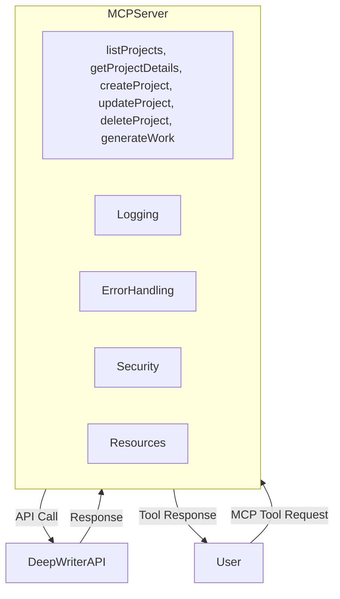

# Implementation Plan: DeepWriter MCP Server

## Overview

This plan outlines the steps to implement an MCP server that integrates with DeepWriter's API, following the provided schemas and best practices for security, error handling, and maintainability.

---

## 1. Memory Bank Initialization

- [x] Create all required core files in memory-bank/ to document project context, architecture, technology, and progress.

---

## 2. MCP Server Scaffolding

- Set up a new Node.js/TypeScript project for the MCP server.
- Implement stdio or SSE protocol for MCP tool communication.
- Configure environment variable management (dotenv).

---

## 3. Tool Implementation

Implement each MCP tool as a discrete module, following the provided schemas:

- listProjects
- getProjectDetails
- createProject
- updateProject
- deleteProject
- generateWork

Each tool:
- Validates input against schema.
- Calls the appropriate DeepWriter API endpoint.
- Handles and maps errors to MCP responses.
- Returns output in the specified schema.

---

## 4. API Integration

- Use fetch (node-fetch or native) for HTTP requests.
- Pass API key in x-api-key header.
- Use HTTPS for all requests.
- Implement retry logic for transient failures.

---

## 5. Error Handling & Security

- Centralized error handler for mapping API errors (401, 403, 404, 400, 500).
- Never log API keys or sensitive data.
- Input sanitization and validation.
- Enforce rate limiting and monitor for abuse.

---

## 6. Logging & Resources

- Log activity and errors (excluding sensitive data) for debugging and transparency.
- Expose resources for:
  - API key validation status
  - Current rate limits
  - Usage statistics
  - Error logs
  - Request history

---

## 7. Testing

- Write unit and integration tests for all tools and error cases.
- Test rate limiting, retry logic, and input validation.

---

## 8. Documentation & Maintenance

- Document usage, endpoints, and maintenance procedures.
- Monitor for DeepWriter API changes and update as needed.
- Maintain up-to-date schemas and error handling.

---

## High-Level Architecture

---

## Next Steps

1. Review and approve this plan.
2. Switch to implementation mode and begin scaffolding the MCP server project.